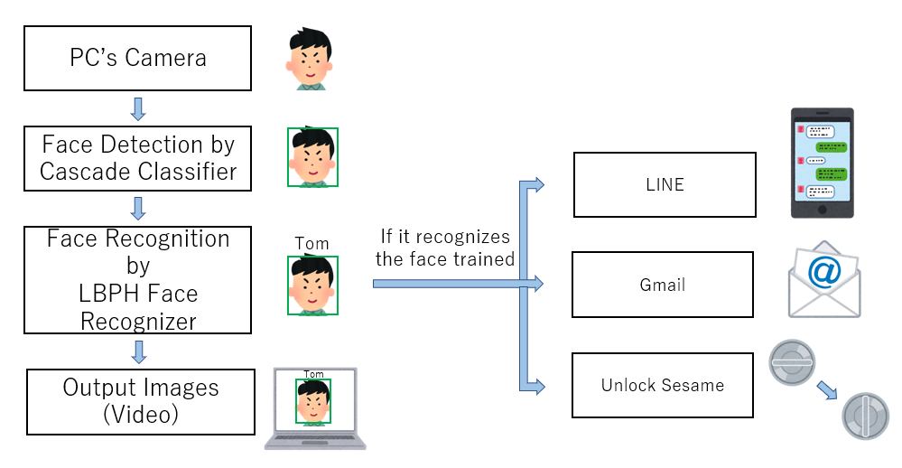

# Face Recogniton and Sesame by Python3
# 顔認識を用いたセサミ開錠

This project focuses on Face Recognition and Sesame(Smart Lock) by Python3.

- Python3
- OpenCV
- pysesame3



## Usage

### Requirements 
```
pip install -r requirements.txt
```

### 1. Prepare Datasets
```
python 01_dataset.py
```
Then, if this is your first time running, enter UserID: `1` and start_count: `1`.

### 2. Train
```
python 02_train.py
```

### 3. Recognition
```
python 03_recog.py
``` 
---
## If you have an opencv error
- ` AttributeError: module 'cv2' has no attribute 'face' `

try the code below

上記のエラーに遭遇したら、以下を試してください。

```
pip install opencv-contrib-python --upgrade
```
if it doesn't work
```
pip install opencv-contrib-python --user
```

---
### References
Part of these sites is written in Japanese, please translate if you can't read.

Sesame Smart Lock: https://jp.candyhouse.co/products/sesame3

Usage of pysesame: https://pysesame3.readthedocs.io/en/latest/usage/

How to get Sesame API: https://partners.candyhouse.co/login

How to get Sesame Secret Key(JP): https://zenn.dev/key3/articles/6c1c2841d7a8a2
